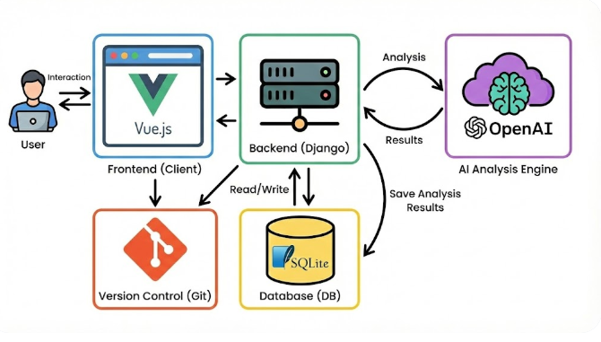
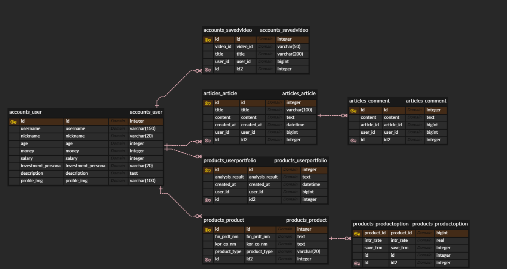

# 💰 WALLET.GG: AI 기반 개인 맞춤형 금융 자산 관리 플랫폼
"금융 관리에 승리의 확신을 더하다, WALLET.GG 🎮"

## 본 프로젝트는 사용자의 자산 데이터를 분석하여 **AI 투자 페르소나(동물 성향)**를 부여하고, 이를 바탕으로 최적의 금융 상품과 영상 콘텐츠를 제안하는 지능형 금융 대시보드 서비스입니다.

## ⏱️ 프로젝트 기간
전체 일정: 2025.12.18 ~ 2025.12.26 (최종 발표)

개발 진행: 12월 18일(D-7) 기획 및 환경 구축을 시작으로 12월 26일 서비스 최종 시연을 완료함

## 🖥️ 시스템 아키텍처 (System Architecture)

## ERD

## 👨‍👩‍👧 팀원 소개 및 역할 분담
팀장	손영록	: 서비스 설계 및 커뮤니티: 로그인/로그아웃 시스템 구축, 게시판(CRUD) 및 댓글 기능 구현, 사용자 프로필 페이지(조회/수정) 개발, 기본 AI 추천 알고리즘 설계

팀원	김국동 : AI 고도화 및 API 연동: AI 추천 알고리즘 고도화 및 투자 페르소나(동물) 관련 로직 구현, 금융감독원/YouTube/Kakao Map API 기반 핵심 기능 구현

## ✨ 핵심 구현 기능
### 1. AI 투자 페르소나 및 고도화된 추천 시스템
- 페르소나 분석: 사용자의 연령, 연봉, 자산 데이터를 정밀 분석하여 호랑이(공격형), 거북이(방어형) 등 고유의 투자 동물 성향을 부여함

- 지능형 추천 로직: 부여된 페르소나의 위험 감수 성향과 자산 상태를 고려하여, OpenAI API를 통해 개인별 맞춤 금융 상품 및 자산 관리 전략을 동적으로 제안함

### 2. YouTube API 기반 맞춤형 금융 콘텐츠 서비스
영상 검색 및 북마크: YouTube Data API v3를 사용하여 사용자의 투자 성향에 적합한 영상을 실시간 검색하고 북마크 기능을 제공함

프로필 페이지 연동: 북마크한 영상 리스트는 프로필 페이지의 '관심 영상' 섹션에 자동으로 연동되어 저장된 영상을 한눈에 확인하고 재시청할 수 있음

### 3. Kakao Map API 기반 금융 인프라 및 경로 탐색
주변 은행 찾기: 전국 시군구 리스트 데이터를 활용하여 사용자의 위치 기반(도/시/군 설정) 인근 은행 영업점을 지도에 시각화함

경로 검색 기능: 탐색된 핀을 클릭하면 현재 위치로부터 해당 은행까지의 이동 경로를 동적으로 도출하여 오프라인 접근성을 강화함

### 4. 금융감독원 API 기반 종합 상품 관리 시스템
종합 목록 및 상세 조회: 실시간 금융 상품 데이터를 수집하여 필터링 가능한 상품 목록 페이지와 상세 페이지를 제공하며, 비로그인 시 상위 금리 상품 5개를 선별 노출함

북마크 및 프로필 연동: 관심 상품 저장 시 User 모델과 실시간 연동되어 프로필 페이지에서 가입 상품 및 관심 리스트를 통합 관리함

## 🚀 로컬 실행 방법
### Backend (Django)
- cd final_pjt_back
- python -m venv venv
- venv\Scripts\activate / Mac: source venv/bin/activate
- pip install -r requirements.txt
- python manage.py makemigrations
- python manage.py migrate
- python manage.py runserver

### Frontend (Vue 3)
- npm i
- npm run dev

## 🧪 트러블슈팅 (Troubleshooting)
### 1. Django 모델 선언 순서에 따른 ImportError 해결
- 문제 상황: 서버 실행 시 ImportError: cannot import name 'SavedVideo' 발생

- 원인 분석: models.py 내에서 유저 모델과 이를 참조하는 북마크 모델 간 정의 순서 오류로 인해 발생함

- 해결 방법: User 모델을 최상단에 배치하고 SavedVideo가 하단에서 참조하도록 순서를 재배치하여 초기화 오류를 해결함

### 2. Vue Router 동적 파라미터(username) 전송 오류
- 문제 상황: 프로필 수정 완료 후 메인 이동 시 Missing required param "username" 에러 발생

- 원인 분석: 동적 경로(profile/:username) 이동 시 필수 파라미터인 username을 전달하지 않음

- 해결 방법: router.push 시 params: { username: store.username }를 명시적으로 추가하여 안정적인 라우팅을 구현함

### 3. dj-rest-auth 회원가입 필드 및 이메일 전송 오류
- 문제 상황: 가입 시 비밀번호 확인(password2) 필드 누락 및 이메일 서버 미설정으로 인한 에러 발생

- 해결 방법: 프론트엔드 전송 시 비밀번호 값을 두 필드에 복사하여 전송하고, 백엔드 시리얼라이저에서 - 이메일 전송 로직을 삭제하여 해결함

### 4. Kakao Map API 환경 변수 및 CORS 정책 문제
- 문제 상황: 프론트엔드 로딩 시 401 인증 오류 및 CORS 차단 현상 발생

- 원인 분석: Vite 환경 변수 접두사(VITE_) 누락 및 카카오 개발자 센터 도메인 미등록이 원인임

- 해결 방법: 변수명을 VITE_KAKAO_JS_KEY로 수정하고 플랫폼 설정에 서비스 도메인을 등록하여 해결함

### 5. DB 컬럼명 불일치에 따른 데이터 조회 오류
- 문제 상황: 자산 데이터 연동 시 특정 데이터가 누락되는 현상이 발생함

- 원인 분석: 원본 엑셀 컬럼명(Close/Last)과 DB 스키마 명칭의 불일치가 원인임

- 해결 방법: 데이터 로딩 스크립트에서 컬럼명을 명시적으로 매핑하여 데이터 정합성을 확보함